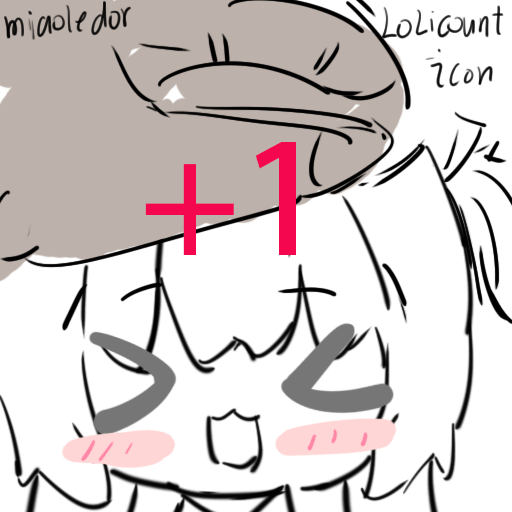

<p align="center"></p>

<h1 align="center">Lolicount !</h1>


**[中文](./README.md)** · **English** · [日本語](./README.ja.md)

### Show your favorite characters on your homepage or anywhere that supports external image sources!

A cute, themeable visitor counter that renders as an SVG image. It ships with several built-in themes, and you can also upload your own digit images or backgrounds to create a custom style. Just paste one link in your README or homepage!

Displayed characters support random frame selection and dynamic composition like character sprites in galgames.


## Quick Start

### Direct Usage
See https://lolicount.top

### Dev Test Run

The root `package.json` uses `concurrently` to start both the backend (Go :9721) and the frontend (Nuxt :3721) at the same time, cross-platform compatible with macOS / Windows / Linux:

```bash
pnpm install        # installs concurrently (root) and frontend deps
pnpm dev            # starts both frontend and backend
```

You can also run them separately: `pnpm dev:server` (backend only) or `pnpm dev:web` (frontend only).

### Server Deployment

```bash
docker run -d -p 9721:9721 \
  -v lolicount-data:/app/data \
  ghcr.io/miaoledor/lolicount:latest
```

Open `http://localhost:9721/@my-counter`. Counter data is persisted to the SQLite file inside the `lolicount-data` volume.

CI/CD is powered by GitHub Actions: pushes trigger `go vet` + tests automatically, and pushing a `v*` tag builds the frontend, compiles a static binary, and pushes a Docker image to ghcr.io.

## Contributing

We really need your help!

Whether enriching features or adding themes, your participation is welcome.
For more contribution `details`, see:
| Document | Content |
|---|---|
| [CONTRIBUTING.md](./CONTRIBUTING.md) | Contribution overview |
| [docs/contributing-themes.md](./docs/contributing-themes.md) | Theme contribution guide |
| [docs/contributing-code.md](./docs/contributing-code.md) | Code contribution guide |

## Acknowledgements

- [kun-galgame-forum](https://github.com/KunMoe/kun-galgame-forum)
- [Moe-Counter](https://github.com/journey-ad/Moe-Counter)

## Sponsor

Like this project? If Lolicount helps you, consider [buying the author a milk tea](https://github.com/sponsors/miaoledor) 🧋

## Tech Stack

**Backend**: Go 1.25+ / Fiber v3 / SQLite
**Frontend**: Vue (Nuxt 4 SSG) / UnoCSS / GSAP
**Storage**: request → in-memory buffer → batched writes → SQLite
**Deployment**: single binary (embed.FS bundles themes + frontend dist)
For more technical details, see the following documents:
| Document | Content |
|---|---|
| [docs/architecture.md](./docs/architecture.md) | Architecture, project structure, tech choices |
| [docs/deployment.md](./docs/deployment.md) | Usage & deployment (Win/Mac/Linux) |
| [docs/projectDesign.md](./docs/projectDesign.md) | Project design & interface contract |
| [docs/TODOlist.md](./docs/TODOlist.md) | Milestones & task status |

## License

This project is licensed under the [AGPL-3.0](./LICENSE) license.

本项目基于 [AGPL-3.0](./LICENSE) 协议开源。


